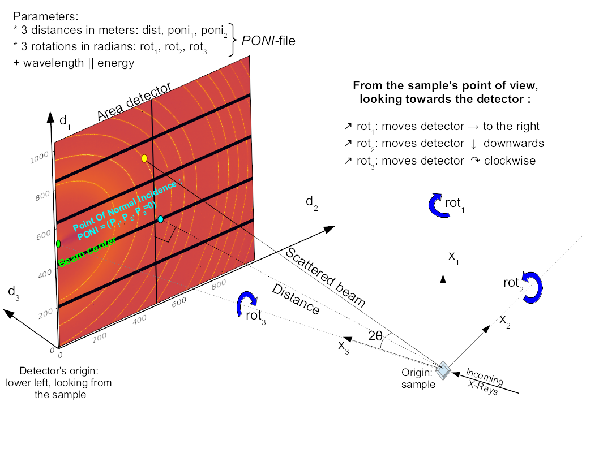

# pyFAIPseudoCounterController

A PseudoCounter that uses [pyFAI](https://pyfai.readthedocs.io/) azimuthal integration/ reordering of 2D scattering images.
It provides 4 PseudoCounter axes:
* `q`: spectrum of momentum transfer coordinates (unit: 1/nm)
* `chi`: spectrum of azimuthal angle coordinates (unit: degree)
* `I1d`: spectrum of azimuthally integrated intensities as function of `q`
* `I2d`: image of reordered intensities as function of `q` and `chi`

## Requirements

* pyFAI, including its dependencies

## Creating the PseudoCounters

Here is an example spock command to create the PseudoCounter with the name "faictrl" using a 2D ExpChannel called "ccd" as image source:

`defctrl FAIPseudoCounterController faictrl image=ccd q=aiQ chi=aiChi I1d=ai1d I2d=ai2d`

## Configuring the azimuthal integration

The PseudoCounter _controller_ has attributes named similarly to the pyFAI AzimuthalIntegrator parameters. These can be set directly:

To set the wavelength used:

`faictrl.wavelength = 1.59e-9`

Alternatively, the energy (in keV) can be set:

`faictrl.energy = 0.779`

Other parameters relate to the sample/detector geometry. The detector class used here is a simple contiguous detector with rectangular pixels. Check the [pyFAI documentation](https://pyfai.readthedocs.io/) for details.

### List of parameters/ controller attributes

| attribute | unit | description |
| - | - | - |
| dist | m | distance sample - detector plane (orthogonal distance, not along the beam)
| npt_q | none | number of points in radial (q) direction
| npt_chi | none | number of points in azimuthal (chi) direction
| wavelength | m | wavelength used - will calculate photon energy accordingly
| energy | keV | photon energy - will calculate wavelength accordingly
| pixel1 | m | pixel size of first detector dimension
| pixel2 | m | pixel size of second detector dimension
| poni1 | m | coordinate of the point of normal incidence along the detector's first dimension (ususally vertical axis)
| poni2 | m | coordinate of the point of normal incidence along the detector's second dimension (ususally horizontal axis)
| rot1 | rad | First rotation from sample ref to detector's ref
| rot2 | rad | Second rotation from sample ref to detector's ref
| rot3 | rad | Third rotation from sample ref to detector's ref

(source: pyfai documentation)

## Configuration macro

todo...